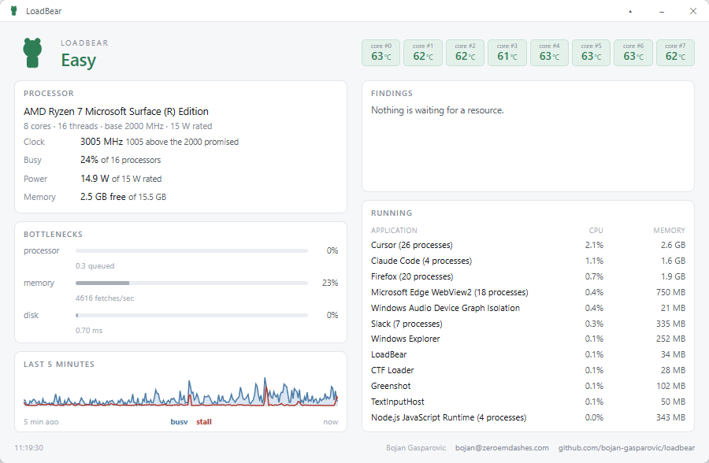
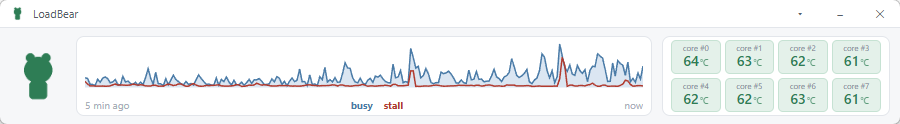

# LoadBear

A resident monitor that shows you what is overloading your machine, not merely that it is busy.

> Status: working on Windows and used daily on the machine it was written on. See [Installing it](#installing-it).



It also folds to a strip that can sit on top of everything else without covering it, which is where it spends most of its time.



## Why

Developers run Docker containers, dev servers, builds, IDE indexers, browsers and increasingly local models, all at once. Machines get overloaded constantly, and the first sign is usually that everything feels slow. By then you are guessing at the cause.

Existing tools show you numbers. Task Manager, HWiNFO, btop and nvtop will all happily tell you the CPU is at 100%, which is not the same as telling you something is wrong.

The distinction LoadBear is built around:

- 100% CPU with a short run queue is a machine working well
- 40% CPU while paging to disk is a machine dying, and most tools make that look fine

## What it does

- **Measures stall rather than utilization.** Stall is time that work spent waiting on a resource instead of progressing, reported for the processor, memory and disk.
- **Names what is responsible.** Process groups carry the name a person would use rather than the executable, and Docker containers are resolved through the engine API. This is the part that separates it from Task Manager: "you are overloaded" is something you already knew by the time you looked.
- **Judges against published limits.** Every finding carries the authority its threshold rests on, so you can check it.
- **Waits before it panics.** A condition has to hold before the state escalates, so a two second spike does not turn the bear red.
- **Reads the hardware where it can.** Per-core temperature, package power, and the sustained all-core clock against the guaranteed base clock.

It is a window you look at. It does not send notifications and is not going to.

## How it judges

Judgements trace to a vendor guarantee or a hardware bit, never to an invented threshold:

| Check | Status |
|---|---|
| Sustained clock against the guaranteed base clock | working |
| Package power against the rated and configurable TDP band | working |
| Package power far below the rating, which means something is starving it | working |
| Headroom to the junction temperature limit | working |
| Whether the hardware is asserting a throttle signal | not wired, see [Known gaps](#known-gaps) |

LoadBear does not tell you what is "normal" for your CPU, because nobody publishes that and it is not a chassis-independent quantity. It tells you what is out of spec.

Cores, threads and the base clock come from the operating system, so they are right on any processor. A small embedded database adds the two things a machine cannot report about itself, the rated power band and the junction limit, and its absence costs those two judgements rather than the whole reading.

## Installing it

Windows 10 or 11 on x86-64. Download `LoadBear_<version>_x64-setup.exe` from [Releases](https://github.com/bojan-gasparovic/loadbear/releases) and run it.

**The installer is not code signed.** SmartScreen will say the publisher is unknown. Choose "More info", then "Run anyway", or check the SHA-256 against the one published with the release first. LoadBear is given away, and a Windows signing certificate is a few hundred dollars a year, so it stays unsigned. The source is here and it builds in one command if you would rather not take the binary on trust.

It installs to `C:\Program Files\LoadBear` and asks for administrator rights once to do it. The application itself runs as you, with no privileges of its own.

### Temperature and package power

Everything works out of the box except these two, which need ring-0 access. LoadBear ships no driver, so it borrows one. In the window, press **Enable temperature**.

That does two things behind a single consent prompt:

1. Installs [PawnIO](https://pawnio.eu), from its official release URL, after checking the signature. It is signed, HVCI compatible, and runs sandboxed bytecode modules rather than exposing raw ring-0 primitives. LoadBear deliberately does not redistribute it, which is what keeps the licensing clean. WinRing0, the traditional answer, is on the Windows vulnerable driver blocklist and is not an option.
2. Registers `LoadBearHelper`, a service running as Local System that reads the sensors and publishes them into shared memory the interface reads without any privileges of its own.

Elevation is paid once. Decline it and everything else still works, with temperature and power reported as unavailable rather than guessed at.

### Removing it

Uninstall from Settings, Apps. The uninstaller stops and deregisters the helper service before it removes anything, so nothing is left running.

If you registered the helper by hand from a source build, there is no uninstaller to do it for you. Undo it from an elevated prompt:

```
target\release\loadbear-service.exe --teardown
```

PawnIO is left installed on purpose. LoadBear did not write it, other monitoring tools use the same driver, and removing something you may depend on elsewhere is not an uninstaller's business. Remove it separately if you want it gone.

## Building it

Requirements: Rust 1.75 or later, Windows 10 or 11 on x86-64.

To run it from source:

```
cargo build --release
target\release\loadbear-app.exe
```

Temperature needs the helper registered from an elevated prompt, since a source build has no installer to do it:

```
target\release\loadbear-service.exe --setup
```

To produce the installer, which also needs the Tauri CLI (`cargo install tauri-cli --version "^2.0"`):

```
.\build-installer.ps1
```

The script builds the helper, stages it under the name the bundler expects, and runs the bundle. It exists because the helper is a sidecar: `cargo tauri build` alone builds only the interface, and a stale or missing sidecar produces an installer that looks fine and ships an application whose temperature is permanently dead.

## Known gaps

Stated plainly, because a monitor that overstates what it knows is worse than no monitor:

- **Windows only.** The core diagnosis crate makes no operating system call and is written for three platforms, but only the Windows backend exists.
- **The throttle verdict never fires.** The check is written and tested. No register source has been found that meets the rule the sensor crate holds itself to, which is that nothing is derived from a forum post.
- **Disk stall reads low on an SSD.** It is scaled against 50 ms per transfer, which is a mechanical disk figure. Measured against a load built to saturate it, an NVMe peaked at 3.4 ms, so that bar cannot leave single digits. The measured latency is shown regardless, and is the number worth reading.
- **Intel temperature is unverified.** It is written, wired and unit tested, and no value in it has yet been read off an Intel part, because it was written on an AMD machine. It fails closed rather than guessing.
- **A container's CPU reads zero.** Its memory is exact. The engine's one-shot statistics ship no baseline to difference against.
- **The bear is a placeholder.** It is a crude silhouette awaiting an illustrator.

## Platforms

Designed for three, shipping in order:

| Platform | Status |
|---|---|
| Windows | working |
| macOS | designed, not started |
| Linux | designed, not started |

## Licence

Apache-2.0. See [LICENSE](LICENSE).
